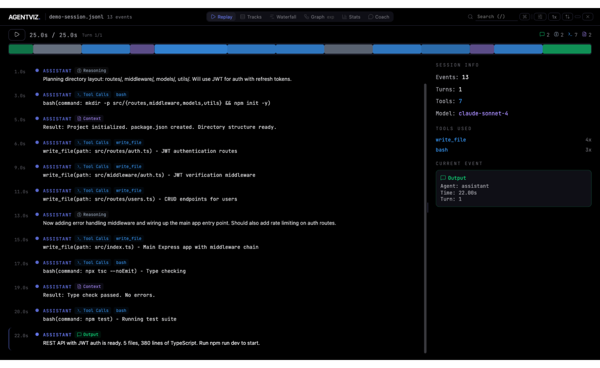
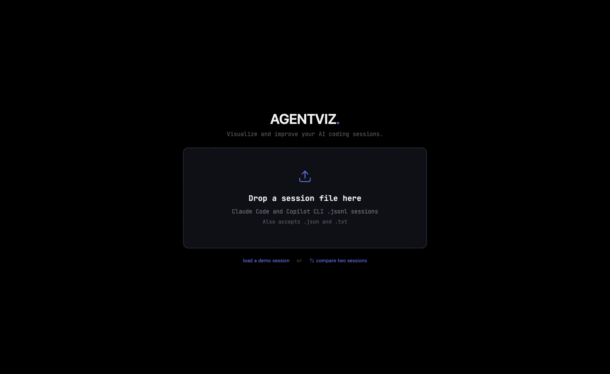
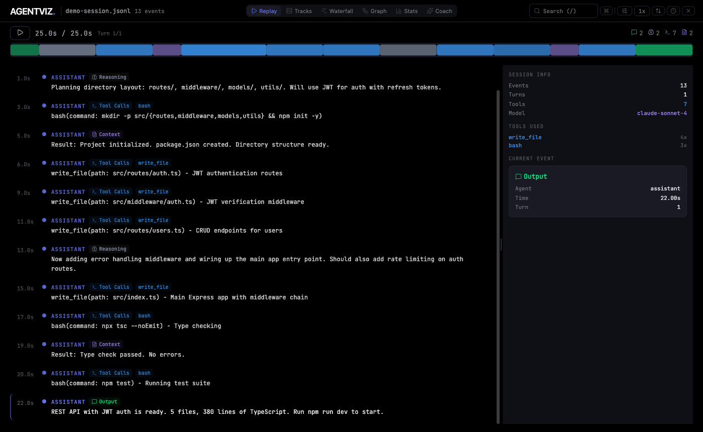
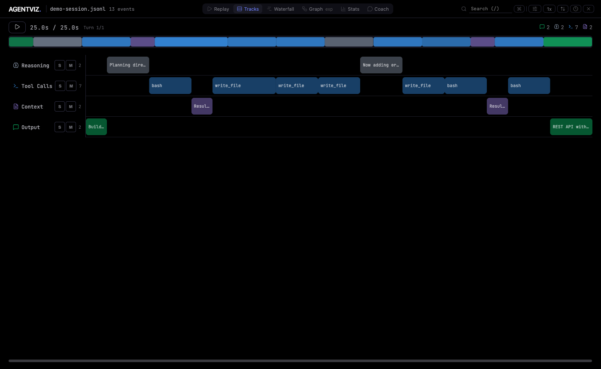
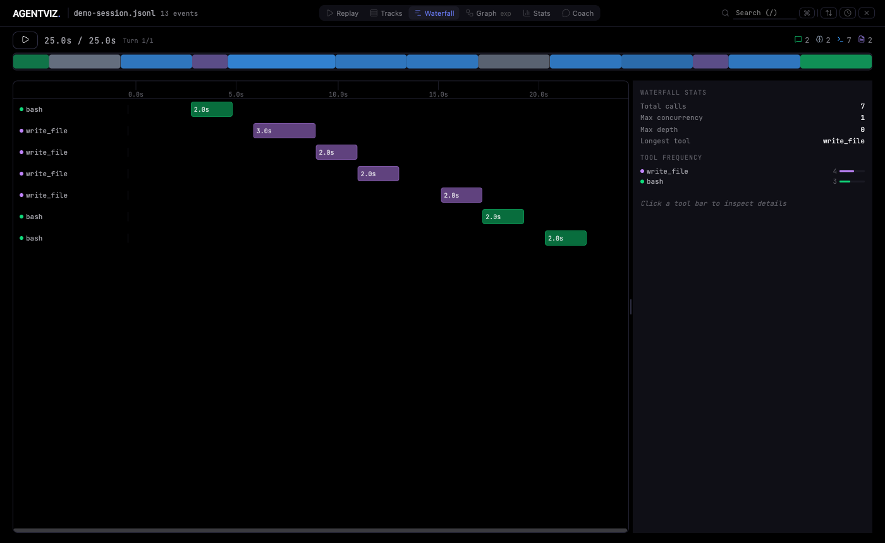
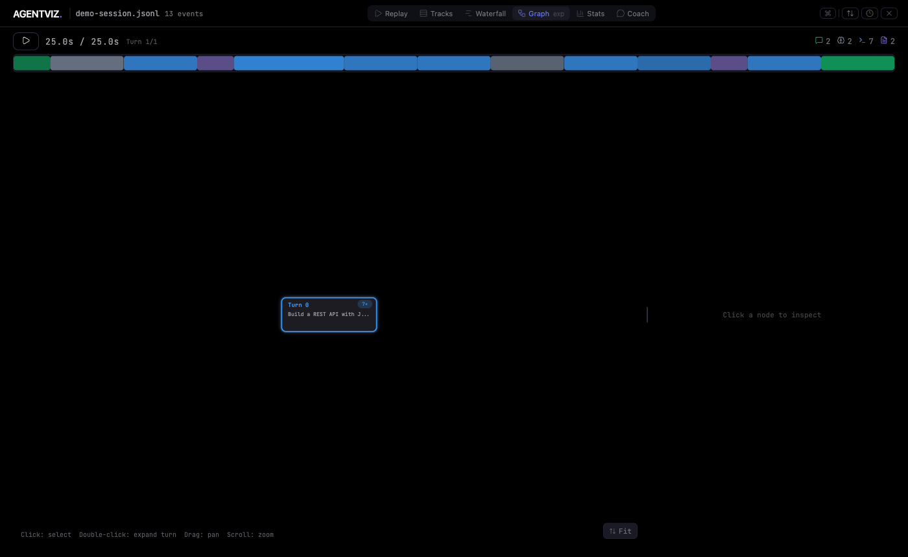
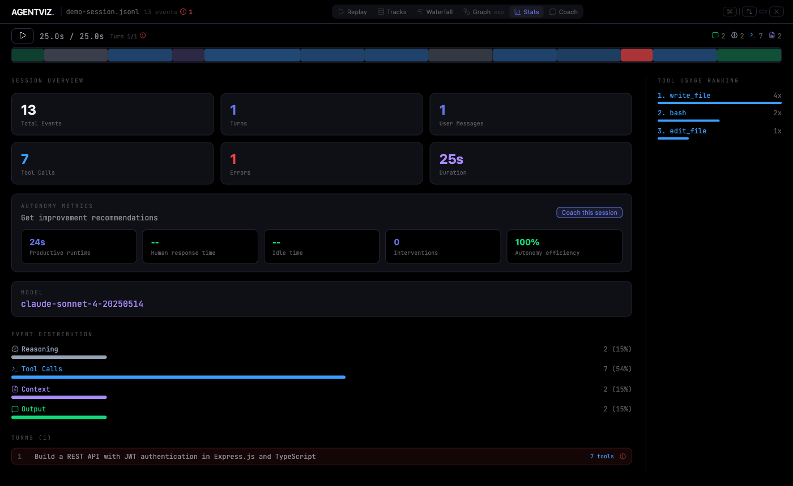
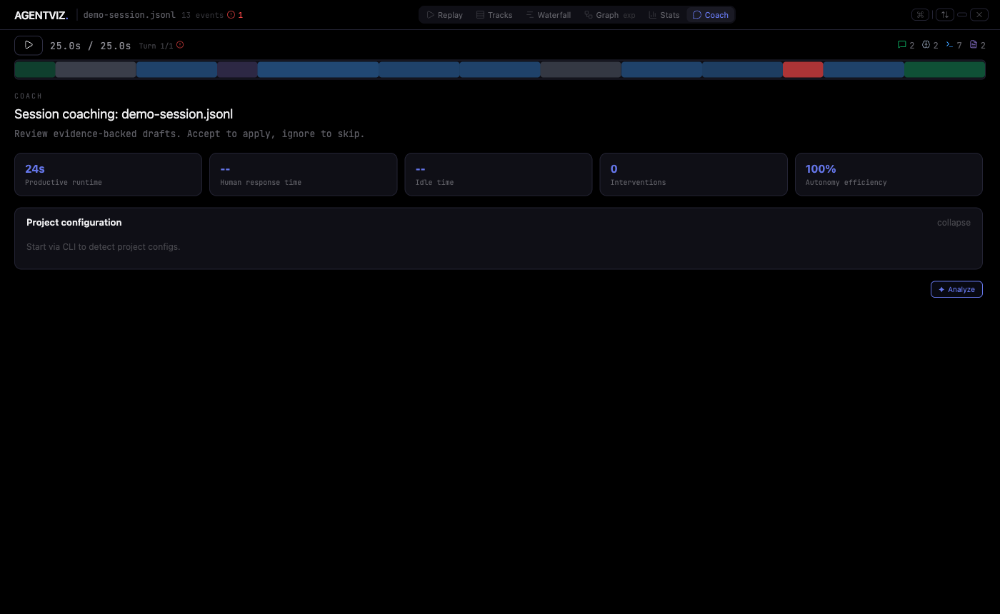

<div align="center">

# ◇ AGENTVIZ

**See what your AI agents actually do.**

Drop a Claude Code or Copilot CLI session file and explore the agent's reasoning, tool calls, turn flow, and output through replay, tracks, waterfall, graph, and stats views. Or run it from the CLI for a live view that updates as your session unfolds.

[](https://github.com/jayparikh/agentviz/actions/workflows/ci.yml)


<br />



*Move between replay, tracks, waterfall, graph, and stats views to inspect the same session from different angles.*

</div>

---

## Why AGENTVIZ?

AI coding agents (Claude Code, Copilot CLI, etc.) generate dense session logs, but reading raw JSONL is painful. AGENTVIZ turns those logs into something you can actually explore:

- **Replay** sessions like a video, stepping through each tool call and reasoning step
- **Trace** decision flow in a graph view with expandable turn and tool-call structure
- **Visualize** timing and concurrency in tracks and waterfall timelines
- **Analyze** tool usage patterns, error rates, and model behavior at a glance
- **Debug** failures by jumping directly between errors with one keystroke
- **Stream live** as a session unfolds -- the view updates in real time
- **Discover sessions** automatically from the Copilot CLI session store
- **Get AI coaching** on prompt engineering, skills, and MCP setup grounded in best practices

## Quick Start

### Web app (drag and drop)

```bash
git clone https://github.com/jayparikh/agentviz.git
cd agentviz
npm install
npm run dev
```

Opens at [localhost:3000](http://localhost:3000). Drop a `.jsonl` session file or click **load a demo session** to try it instantly.

### CLI (live streaming)

```bash
# Point at a specific session file
node bin/agentviz.js ~/.claude/projects/my-project/session.jsonl

# Or pass a directory -- opens the most recently modified .jsonl inside it
node bin/agentviz.js ~/.claude/projects/my-project/
```

The browser opens with a pulsing **LIVE** badge. As Claude Code writes new events to the session file, they stream into the view in real time via SSE, including records that are written incrementally before the trailing newline lands.

### Finding your session files

```bash
# Claude Code sessions
ls ~/.claude/projects/

# Copilot CLI sessions
ls ~/.copilot/session-state/
# Each subdirectory is a session UUID containing an events.jsonl file
```

## MCP Integration

AGENTVIZ ships as an MCP server so you can open it directly from Claude Code or GitHub Copilot in VS Code without leaving your workflow. Both agents use the same `launch_agentviz` and `close_agentviz` tools.

### Claude Code

**Setup (one time):**

```bash
claude mcp add --scope user agentviz node /path/to/agentviz/mcp/server.js
```

This registers the server globally across all projects. Restart Claude Code to pick it up.

**Usage:** In any session, just ask:

> "Open agentviz" or "Show me the live view"

### GitHub Copilot in VS Code

**Setup:** Add the server to your VS Code user settings (`settings.json`) for global access across all projects:

```json
{
  "mcp": {
    "servers": {
      "agentviz": {
        "type": "stdio",
        "command": "node",
        "args": ["/path/to/agentviz/mcp/server.js"]
      }
    }
  }
}
```

Or scope it to a single project by creating `.vscode/mcp.json` in your workspace:

```json
{
  "servers": {
    "agentviz": {
      "type": "stdio",
      "command": "node",
      "args": ["/path/to/agentviz/mcp/server.js"]
    }
  }
}
```

Reload VS Code after adding the config. In Copilot Chat, use **Agent mode** and ask:

> "Open agentviz" or "Launch the live view"

### What happens when you invoke it

`launch_agentviz` will:
1. Auto-detect the most recently active session file (checks `~/.claude/projects/` and `~/.copilot/session-state/`)
2. Start a local HTTP server on a free port
3. Open the browser with live streaming enabled

To stop it, ask: "Close agentviz"

### Available MCP tools

| Tool | Description |
|------|-------------|
| `launch_agentviz` | Start the server and open the browser. Accepts an optional `session_file` path. |
| `close_agentviz` | Stop a running server. Accepts an optional `port`; omit to stop all. |

## Inbox and AI Coach

When running via the CLI, AGENTVIZ automatically discovers recent sessions from `~/.copilot/session-state/` and lists them in an inbox sorted by review priority. Click any session to open it in the visualizer.

Each session also gets an AI Coach analysis powered by the `@github/copilot-sdk` (gpt-4o). The coach reads your actual project config (`.github/copilot-instructions.md`, skills, MCP servers) and produces actionable recommendations for prompts, skills, and tooling setup. Recommendations can be applied directly with one click.

## Session Comparison

Load two agent traces side by side to compare them head to head. Great for benchmarking Claude Code vs Copilot CLI on the same task, or comparing two different prompting strategies.

### Entry points

- **Landing screen** -- click "compare two sessions" below the drop zone
- **Single-session header** -- click **Compare** while viewing any session to add a second trace for comparison
- **Compare landing** -- drop Session A and Session B independently; the view opens once both are loaded

### Scorecard tab

Side-by-side metrics with delta badges:

| Metric | Delta color |
|--------|-------------|
| Duration | Green = A faster |
| Cost / PRUs | Green = A cheaper (delta suppressed for cross-agent comparisons since units differ) |
| Input / Output tokens | Neutral |
| Cache reads / writes | Neutral (shown only when cache data present) |
| Premium requests (PRU) | Green = A uses fewer (shown only for Copilot sessions) |
| Tool calls | Neutral |
| Errors | Green = A has fewer |
| Turns | Neutral |
| Files touched | Neutral |

### Tools tab

Horizontal bar chart showing tool call counts for both sessions on the same axis. Blue bars = Session A, purple bars = Session B.

### Export

Click **Export** in any header to download a single self-contained `.html` file. Share it with anyone -- no server required. Opening it reproduces the full session or comparison view exactly as you see it.

Export is available in two places:
- **Single session header** -- exports the current session
- **Comparison header** -- exports both sessions and the full comparison view

> Export requires the production build (`npm run build`). It is not available in the Vite dev server.

---

## Features

### Landing View

Drop zone for session files, with a demo session available instantly. When running via the CLI, the inbox is shown here instead -- auto-discovered sessions from `~/.copilot/session-state/` sorted by review priority.

<div align="center">

</div>

### Replay View

Chronological event stream with a resizable inspector sidebar. Click any event to see full details plus a payload inspector with readable JSON or text, top-level keys, line and character counts, copy support, and expand or collapse controls. The colorful timeline bar at top shows event density and error locations.

<div align="center">

</div>

### Tracks View

DAW-style multi-track lanes for Reasoning, Tool Calls, Context, and Output. **Solo** isolates one track. **Mute** hides it. See at a glance how your agent's time was spent.

<div align="center">

</div>

### Waterfall View

Gantt-style timeline of every tool call, sorted by start time with nesting for overlapping calls. Hover any bar to see duration and timing. Click to open the full inspector, including inline diffs for file edits and readable input or result payload previews.

<div align="center">

</div>

### Graph View

Interactive directed graph of session turns with expandable tool-call structure. Double-click a turn to open its internal tool flow, pan and zoom around the graph, and follow playback as active nodes light up and future nodes fade back.

<div align="center">

</div>

### Stats View

Aggregate metrics, event distribution bars, tool usage ranking, and a per-turn summary. Includes token counts and estimated USD cost per turn for Claude models.

<div align="center">

</div>

### Coach View

AI-powered session coaching available directly from any session. The coach reads your autonomy metrics, project config (`.github/copilot-instructions.md`, MCP servers, skills), and session patterns to produce evidence-backed recommendations for prompts, tooling, and workflow. Click **Analyze** to run, then accept or ignore each draft recommendation. Requires the CLI server -- run via `node bin/agentviz.js` or the MCP tool.

<div align="center">

</div>

### More Features

| Feature | Description |
|---------|-------------|
| **Live Streaming** | CLI mode tails a session file via SSE. View updates in real time as events arrive, including newline-delayed JSONL writes from Claude Code. |
| **Payload Inspector** | Replay and waterfall inspectors show readable JSON or text previews with key summaries, counts, copy, and expand controls. |
| **Graph View** | Directed turn-flow graph with expandable tool-call nodes, pan/zoom, and playback-aware highlighting. |
| **Token and Cost Tracking** | Per-turn token usage with estimated USD cost for Claude 3/4 models. |
| **Search** | Full-text search across events, tools, and agents. Matches highlighted in real time. |
| **Command Palette** | `Cmd+K` fuzzy search to jump to any turn, event, or view instantly. |
| **Error Navigation** | Auto-detects errors from flags and text patterns. Jump with `E` / `Shift+E`. |
| **Track Filters** | Toggle visibility per track type with filter chips in the header. |
| **Playback Control** | Play/pause with variable speed (0.5x to 8x). Seek with arrow keys. |
| **Diff Viewer** | Inline unified diff with dual-gutter line numbers for file-editing tool calls. |
| **Auto-detect Format** | Supports Claude Code and Copilot CLI JSONL. Format detected from first line. |
| **Session Comparison** | Load two traces side by side. Scorecard and tool-usage chart with delta badges. |
| **HTML Export** | One-click export of any session or comparison to a self-contained shareable `.html` file. |
| **Inbox Auto-discovery** | Automatically finds recent Copilot CLI sessions and ranks them by review priority. |
| **AI Coach** | Agentic analysis powered by Copilot SDK. Recommends prompts, skills, and MCP config with one-click apply. |
| **Session Q&A** | Slide-over drawer (`Cmd+Shift+K`) with instant answers for common queries and Copilot SDK model fallback for open-ended questions. |
| **Autonomy Metrics** | Measures human response time, idle gaps, and intervention frequency per session. |

### Session Q&A

Open the drawer with `Cmd+Shift+K` (or via the command palette). Questions are routed through a two-tier system:

1. **Instant answers** -- a local classifier matches 9 common patterns and responds immediately from session data, with no API call:

   | Pattern | Example question |
   |---------|-----------------|
   | Tool count | "how many tool calls?" |
   | Errors | "were there any errors?" |
   | Duration | "how long did this take?" |
   | Models | "what model was used?" |
   | Turns | "how many turns?" |
   | Longest tool | "which tool took the longest?" |
   | Cost | "how much did this cost?" |
   | File edits | "what files were edited?" |
   | Summary | "summarize this session" |

2. **Model fallback** -- anything the classifier can't match is sent to the Copilot SDK (configurable model, see [Configuration](#configuration)) with full session context for an AI-generated answer.

> **Feature flag:** Session Q&A is experimental. Enable it with `localStorage.setItem('agentviz:flag:qa', 'true')` in the browser console.

## Keyboard Shortcuts

| Key | Action |
|-----|--------|
| `Space` | Play / Pause |
| `Left` / `Right` | Seek 2 seconds |
| `1` / `2` / `3` / `4` / `5` / `6` | Switch view (Replay / Tracks / Waterfall / Graph / Stats / Coach) |
| `/` | Focus search |
| `E` / `Shift+E` | Next / Previous error |
| `Cmd+K` | Command palette |
| `Cmd+Shift+K` | Toggle Session Q&A drawer |
| `Enter` / `Shift+Enter` | Next / Previous search match |
| `?` | Toggle keyboard shortcuts dialog |

## Supported Formats

| Format | File type | Auto-detected by |
|--------|-----------|-----------------|
| Claude Code | `.jsonl` from `~/.claude/projects/` | Default fallback |
| Copilot CLI | `.jsonl` event traces | `session.start` with `producer: "copilot-agent"` |

More formats planned: LangSmith traces, OpenTelemetry spans.

## Architecture

```
src/
  App.jsx                # Main orchestrator: file loading, playback, view routing
  hooks/
    usePlayback.js       # Play/pause, speed, seek state machine
    useSearch.js         # Debounced full-text search with match highlighting
    useKeyboardShortcuts.js  # Centralized keyboard handler
    useSessionLoader.js  # File parsing, live init from /api/file, session reset
    useQA.js             # Session Q&A state: messages, classifier, SSE streaming
    useFeatureFlag.js    # localStorage-backed feature flag evaluation
    useLiveStream.js     # SSE EventSource hook with 500ms debounce for live mode
    usePersistentState.js    # localStorage-backed useState with debounced writes
    useDiscoveredSessions.js # Auto-discovery of Copilot CLI sessions via /api/sessions
    useHashRouter.js     # Hash-based routing between inbox and session views
    useAsyncStatus.js    # Async operation state machine (idle/loading/success/error)
  lib/
    parseSession.ts      # Auto-detect format router
    parser.ts            # Claude Code JSONL parser
    copilotCliParser.ts  # Copilot CLI JSONL parser
    dataInspector.js     # Payload summary and preview helpers for inspector panels
    session.ts           # Pure helpers: getSessionTotal, buildFilteredEventEntries
    sessionLibrary.js    # localStorage-backed session library with content persistence
    sessionParsing.ts    # Session parsing utilities and types
    autonomyMetrics.js   # Human response time, idle gaps, intervention scoring
    projectConfig.js     # Project config surface detection (CLAUDE.md, .github/, etc.)
    aiCoachAgent.js      # AI Coach powered by @github/copilot-sdk (gpt-4o)
    qaClassifier.js      # Session Q&A instant answer engine (9 patterns + model context)
    qaAgent.js           # Q&A agent powered by @github/copilot-sdk for model fallback
    theme.js             # Design tokens (true black base, blue/purple/green accents)
    constants.js         # Sample events for demo mode
    replayLayout.js      # Virtualized windowing for large sessions
    commandPalette.js    # Precomputed fuzzy search index
    diffUtils.js         # Diff detection and Myers line diff algorithm
    waterfall.ts         # Waterfall view helpers: item building, stats, layout
    graphLayout.js       # ELKjs graph builder and layout merger for Graph view
    pricing.js           # Claude model pricing table and cost estimation
    exportHtml.js        # Self-contained HTML export for single sessions and comparisons
    formatTime.js        # Duration and date formatting utilities
    playbackUtils.js     # Playback state helpers
  components/
    InboxView.jsx        # Session inbox with auto-discovery, sorting, and review priority
    DebriefView.jsx      # AI Coach panel with cached analysis and one-click apply
    ReplayView.jsx       # Windowed event stream + inspector sidebar
    TracksView.jsx       # DAW-style multi-track timeline
    WaterfallView.jsx    # Tool execution waterfall with nesting and inspector
    GraphView.jsx        # Interactive turn graph with expandable tool-call nodes
    StatsView.jsx        # Aggregate metrics and tool ranking
    CompareView.jsx      # Side-by-side session comparison (Scorecard + Tools tabs)
    CommandPalette.jsx   # Cmd+K fuzzy search overlay
    Timeline.jsx         # Scrubable playback bar with event markers
    DiffViewer.jsx       # Inline unified diff for file-editing tool calls
    DataInspector.jsx    # Readable payload inspector with summaries and copy support
    LiveIndicator.jsx    # Pulsing LIVE badge shown in CLI streaming mode
    ShortcutsModal.jsx   # Keyboard shortcuts overlay
    QADrawer.jsx         # Session Q&A slide-over drawer with instant answers
    RecentSessionsPicker.jsx # Recent sessions dropdown picker
    SyntaxHighlight.jsx  # Lightweight code syntax coloring for payload previews
    ResizablePanel.jsx   # Drag-to-resize split panel utility
    FileUploader.jsx     # Drag-and-drop file input with error handling
    ErrorBoundary.jsx    # React error boundary with resetKey for recovery
    Icon.jsx             # Lucide icon wrapper; all icons must be imported AND added to ICON_MAP
    app/                 # Shell components: AppHeader, AppLandingState, AppLoadingState
    ui/                  # Shared primitives: BrandWordmark, ShellFrame, ToolbarButton
    waterfall/           # Waterfall sub-components: WaterfallChart, WaterfallRow, TimeAxis
bin/
  agentviz.js            # CLI entry point: finds free port, starts server, opens browser
mcp/
  server.js              # MCP server: launch_agentviz and close_agentviz tools
server.js                # HTTP server: serves dist/ SPA + SSE /api/stream file tail
```

### Parser API

`parseSession(text)` auto-detects the format and returns a normalized structure:

```js
// Every event has the same shape regardless of source format
{ t, agent, track, text, duration, intensity, toolName?, toolInput?, raw, turnIndex, isError, model?, tokenUsage?, parentToolCallId? }

// Turns group events by conversation round
{ index, startTime, endTime, eventIndices, userMessage, toolCount, hasError }

// Session-level stats
{ totalEvents, totalTurns, totalToolCalls, errorCount, duration, models, primaryModel, tokenUsage }
```

## Development

```bash
npm run dev             # Vite dev server on port 3000
node bin/agentviz.js    # API backend on port 4242
npm run build           # Production build to dist/
npm test                # Run all tests via Vitest
npm run test:watch      # Watch mode
npm run typecheck       # Type-check with tsc --noEmit
```

> **Full dev setup requires both servers.** `npm run dev` starts the Vite frontend; `node bin/agentviz.js` starts the API backend (Coach, session discovery, config, apply, live streaming). Vite proxies `/api/*` to the backend automatically.

### Design System

True black base (`#000000`) with blue, purple, and green accents. Vivid semantic colors: green for success, muted red for warning, bright red for error. All colors are defined as design tokens in `src/lib/theme.js`. JetBrains Mono throughout. No CSS framework; all styles are inline.

### Configuration

**AI Model** -- The Coach and Session Q&A features use the Copilot SDK. You can override the model:

| Method | Example |
|--------|---------|
| Environment variable | `AGENTVIZ_MODEL=gpt-4o node bin/agentviz.js` |
| Config file | `~/.agentviz/config.json` with `{ "model": "gpt-4o" }` |
| Custom config path | `AGENTVIZ_CONFIG=/path/to/config.json` |

The current model can be queried via `GET /api/models`.

**Feature Flags** -- Experimental features are gated behind localStorage flags:

| Flag | Default | Description |
|------|---------|-------------|
| `qa` | `false` | Session Q&A slide-over drawer |

Enable a flag in the browser console:

```js
localStorage.setItem('agentviz:flag:qa', 'true')
```

## Contributing

Contributions are welcome! Here are some areas where help is appreciated:

- **New parsers**: LangSmith, OpenTelemetry, custom agent frameworks
- **Visualizations**: Graph minimap, large-session clustering, multi-agent hierarchy
- **Features**: Bookmarks/annotations, shareable URLs

Please open an issue to discuss larger changes before submitting a PR.

## Roadmap

- [x] Token count tracking and cost estimation per turn
- [x] Tool execution waterfall / Gantt chart view
- [x] Inline diff viewer for file-editing tool calls
- [x] Live streaming mode (tail a session file in real time)
- [x] CLI launcher: `node bin/agentviz.js session.jsonl`
- [x] MCP server for Claude Code integration (`launch_agentviz` tool)
- [x] Session comparison (dual-trace scorecard + tool usage chart)
- [x] HTML export (self-contained shareable file, single session or comparison)
- [x] Conversation flow graph (directed graph of turns and decisions)
- [x] Inbox auto-discovery (Copilot CLI sessions found and ranked automatically)
- [x] AI Coach agent (session analysis with one-click config recommendations)
- [x] Session Q&A drawer (instant answers + Copilot SDK model fallback)
- [x] Autonomy metrics (human response time, idle gaps, intervention frequency)
- [ ] Bookmarks and annotations (persisted to localStorage)
- [ ] Graph minimap and large-session clustering
- [ ] Multi-agent hierarchy (parent/child agents, nested tracks)
- [ ] Shareable session URLs
- [ ] Vim-style keyboard navigation
- [ ] `npx agentviz` (publish to npm)

## License

MIT
