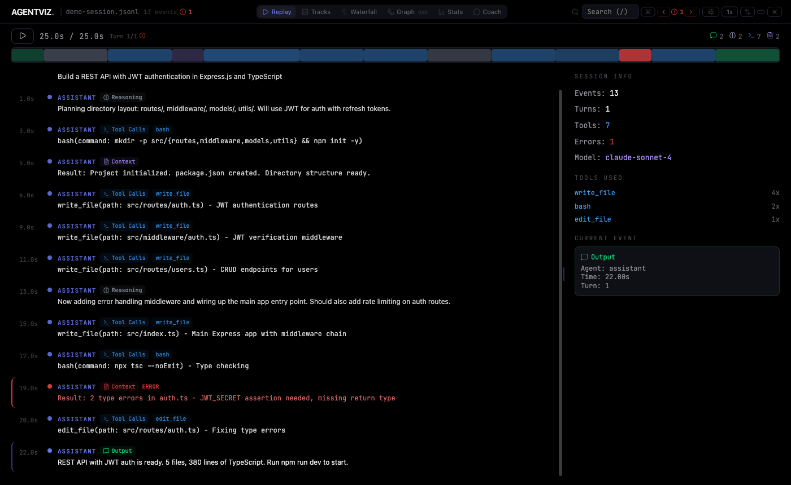
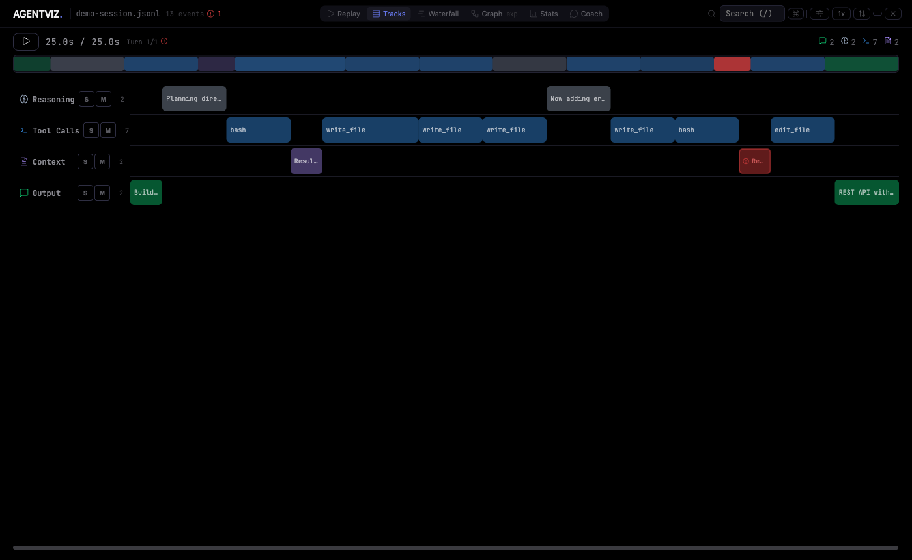
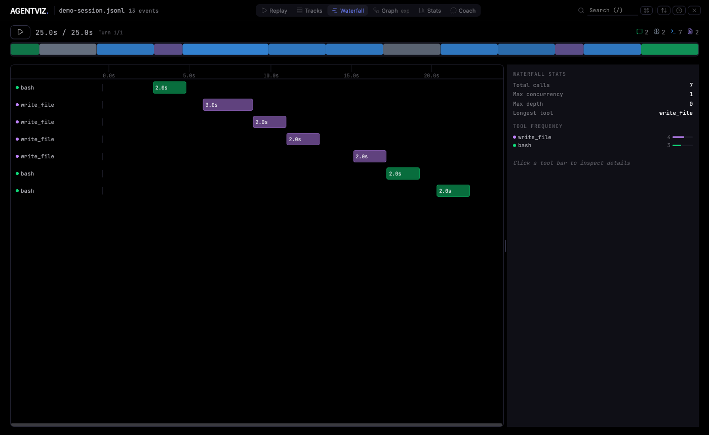
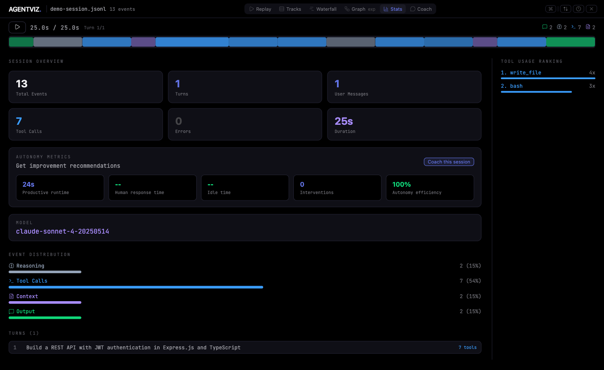

<div align="center">

# ◇ AGENTVIZ

**See what your AI agents actually do.**

Drop a Claude Code or Copilot CLI session file and explore the agent's reasoning, tool calls, and output through an interactive timeline. Or run it from the CLI for a live view that updates as your session unfolds.

[](https://github.com/jayparikh/agentviz/actions/workflows/ci.yml)


<br />



*Replay an AI coding session event by event, with full tool call inspection.*

</div>

---

## Why AGENTVIZ?

AI coding agents (Claude Code, Copilot CLI, etc.) generate dense session logs, but reading raw JSONL is painful. AGENTVIZ turns those logs into something you can actually explore:

- **Replay** sessions like a video, stepping through each tool call and reasoning step
- **Visualize** timing and concurrency in a DAW-style multi-track timeline
- **Analyze** tool usage patterns, error rates, and model behavior at a glance
- **Debug** failures by jumping directly between errors with one keystroke
- **Stream live** as a session unfolds -- the view updates in real time

## Quick Start

### Web app (drag and drop)

```bash
git clone https://github.com/jayparikh/agentviz.git
cd agentviz
npm install
npm run dev
```

Opens at [localhost:3000](http://localhost:3000). Drop a `.jsonl` session file or click **Load Demo Session** to try it instantly.

### CLI (live streaming)

```bash
# Point at any session file and the browser opens automatically
node bin/agentviz.js ~/.claude/projects/my-project/session.jsonl

# Or the most recent session in any project
node bin/agentviz.js ~/.claude/projects/my-project/
```

The browser opens with a pulsing **LIVE** badge. As Claude Code writes new events to the session file, they stream into the view in real time via SSE.

### Finding your session files

```bash
# Claude Code sessions
ls ~/.claude/projects/

# Copilot CLI event traces (location varies by config)
```

## Claude Code MCP Integration

AGENTVIZ ships as a global MCP server so you can open it directly from any Claude Code session without leaving the terminal.

### Setup (one time)

```bash
# From the agentviz directory
claude mcp add --scope user agentviz node /path/to/agentviz/mcp/server.js
```

This registers the server globally. Restart Claude Code to pick it up.

### Usage

In any Claude Code session, in any project, just ask:

> "Open agentviz" or "Show me the live view"

Claude calls the `launch_agentviz` tool, which:
1. Auto-detects the most recently active session file in `~/.claude/projects/`
2. Starts a local HTTP server on a free port
3. Opens the browser with live streaming enabled

To stop it:

> "Close agentviz"

### Available MCP tools

| Tool | Description |
|------|-------------|
| `launch_agentviz` | Start the server and open the browser. Accepts an optional `session_file` path. |
| `close_agentviz` | Stop a running server. Accepts an optional `port`; omit to stop all. |

## Session Comparison

Load two agent traces side by side to compare them head to head. Great for benchmarking Claude Code vs Copilot CLI on the same task, or comparing two different prompting strategies.

### Entry points

- **Landing screen** -- click "compare two sessions" below the drop zone to open dual upload mode
- **Compare landing** -- drop Session A and Session B independently; the comparison view opens once both are loaded

### Scorecard tab

Side-by-side metrics with delta badges:

| Metric | Delta color |
|--------|-------------|
| Duration | Green = A faster |
| Effective cost | Green = A cheaper |
| Input / Output tokens | Neutral |
| Cache reads / writes | Neutral (shown only when cache data present) |
| Tool calls | Neutral |
| Errors | Green = A has fewer |
| Turns | Neutral |
| Files touched | Neutral |

### Tools tab

Horizontal bar chart showing tool call counts for both sessions on the same axis. Blue bars = Session A, purple bars = Session B.

### Export

Click **Export** in the comparison header to download a single self-contained `.html` file. Share it with anyone -- no server required. Opening it reproduces the full comparison view.

---

## Features

### Replay View

Chronological event stream with a resizable inspector sidebar. Click any event to see full details, raw JSON, and tool inputs. The colorful timeline bar at top shows event density and error locations.

<div align="center">

</div>

### Tracks View

DAW-style multi-track lanes for Reasoning, Tool Calls, Context, and Output. Solo (**S**) isolates one track. Mute (**M**) hides it. See at a glance how your agent's time was spent.

<div align="center">

</div>

### Waterfall View

Gantt-style timeline of every tool call, sorted by start time with nesting for overlapping calls. Hover any bar to see duration and timing. Click to open the full inspector, including inline diffs for file edits.

<div align="center">

</div>

### Stats View

Aggregate metrics, event distribution bars, tool usage ranking, and a per-turn summary. Includes token counts and estimated USD cost per turn for Claude models.

<div align="center">

</div>

### More Features

| Feature | Description |
|---------|-------------|
| **Live Streaming** | CLI mode tails a session file via SSE. View updates in real time as events arrive. |
| **Token and Cost Tracking** | Per-turn token usage with estimated USD cost for Claude 3/4 models. |
| **Search** | Full-text search across events, tools, and agents. Matches highlighted in real time. |
| **Command Palette** | `Cmd+K` fuzzy search to jump to any turn, event, or view instantly. |
| **Error Navigation** | Auto-detects errors from flags and text patterns. Jump with `E` / `Shift+E`. |
| **Track Filters** | Toggle visibility per track type with filter chips in the header. |
| **Playback Control** | Play/pause with variable speed (0.5x to 8x). Seek with arrow keys. |
| **Diff Viewer** | Inline unified diff with dual-gutter line numbers for file-editing tool calls. |
| **Auto-detect Format** | Supports Claude Code and Copilot CLI JSONL. Format detected from first line. |
| **Session Comparison** | Load two traces side by side. Scorecard and tool-usage chart with delta badges. |
| **HTML Export** | One-click export of any session or comparison to a self-contained shareable `.html` file. |

## Keyboard Shortcuts

| Key | Action |
|-----|--------|
| `Space` | Play / Pause |
| `Left` / `Right` | Seek 2 seconds |
| `1` / `2` / `3` / `4` | Switch view (Replay / Tracks / Waterfall / Stats) |
| `/` | Focus search |
| `E` / `Shift+E` | Next / Previous error |
| `Cmd+K` | Command palette |
| `Enter` / `Shift+Enter` | Next / Previous search match |

## Supported Formats

| Format | File type | Auto-detected by |
|--------|-----------|-----------------|
| Claude Code | `.jsonl` from `~/.claude/projects/` | Default fallback |
| Copilot CLI | `.jsonl` event traces | `session.start` with `producer: "copilot-agent"` |

More formats planned: LangSmith traces, OpenTelemetry spans.

## Architecture

```
src/
  App.jsx                # Main orchestrator: file loading, playback, view routing
  hooks/
    usePlayback.js       # Play/pause, speed, seek state machine
    useSearch.js         # Debounced full-text search with match highlighting
    useKeyboardShortcuts.js  # Centralized keyboard handler
    useSessionLoader.js  # File parsing, live init from /api/file, session reset
    useLiveStream.js     # SSE EventSource hook with 500ms debounce for live mode
    usePersistentState.js    # localStorage-backed useState with debounced writes
  lib/
    parseSession.js      # Auto-detect format router
    parser.js            # Claude Code JSONL parser
    copilotCliParser.js  # Copilot CLI JSONL parser
    session.js           # Pure helpers: getSessionTotal, buildFilteredEventEntries
    theme.js             # Design tokens (true black base, blue/purple/green accents)
    constants.js         # Sample events for demo mode
    replayLayout.js      # Virtualized windowing for large sessions
    commandPalette.js    # Precomputed fuzzy search index
    diffUtils.js         # Diff detection and Myers line diff algorithm
    waterfall.js         # Waterfall view helpers: item building, stats, layout
    pricing.js           # Claude model pricing table and cost estimation
    exportHtml.js        # Self-contained HTML export for single sessions and comparisons
  components/
    ReplayView.jsx       # Windowed event stream + inspector sidebar
    TracksView.jsx       # DAW-style multi-track timeline
    WaterfallView.jsx    # Tool execution waterfall with nesting and inspector
    StatsView.jsx        # Aggregate metrics and tool ranking
    CompareView.jsx      # Side-by-side session comparison (Scorecard + Tools tabs)
    CommandPalette.jsx   # Cmd+K fuzzy search overlay
    Timeline.jsx         # Scrubable playback bar with event markers
    DiffViewer.jsx       # Inline unified diff for file-editing tool calls
    LiveIndicator.jsx    # Pulsing LIVE badge shown in CLI streaming mode
    SyntaxHighlight.jsx  # Lightweight code syntax coloring for raw data
    ResizablePanel.jsx   # Drag-to-resize split panel utility
    FileUploader.jsx     # Drag-and-drop file input with error handling
    ErrorBoundary.jsx    # React error boundary with resetKey for recovery
    Icon.jsx             # SVG icon component
bin/
  agentviz.js            # CLI entry point: finds free port, starts server, opens browser
mcp/
  server.js              # MCP server: launch_agentviz and close_agentviz tools
server.js                # HTTP server: serves dist/ SPA + SSE /api/stream file tail
```

### Parser API

`parseSession(text)` auto-detects the format and returns a normalized structure:

```js
// Every event has the same shape regardless of source format
{ t, agent, track, text, duration, intensity, toolName?, toolInput?, raw, turnIndex, isError, model?, tokenUsage? }

// Turns group events by conversation round
{ index, startTime, endTime, eventIndices, userMessage, toolCount, hasError }

// Session-level stats
{ totalEvents, totalTurns, totalToolCalls, errorCount, duration, models, primaryModel, tokenUsage }
```

## Development

```bash
npm run dev         # Dev server on port 3000
npm run build       # Production build to dist/
npm test            # Run all tests via Vitest
npm run test:watch  # Watch mode
```

### Design System

True black base (`#000000`) with blue, purple, and green accents. Vivid semantic colors: green for success, muted red for warning, bright red for error. All colors are defined as design tokens in `src/lib/theme.js`. JetBrains Mono throughout. No CSS framework; all styles are inline.

## Contributing

Contributions are welcome! Here are some areas where help is appreciated:

- **New parsers**: LangSmith, OpenTelemetry, custom agent frameworks
- **Visualizations**: Conversation flow graph (directed graph of turns and decisions)
- **Features**: Bookmarks/annotations, session comparison, shareable URLs

Please open an issue to discuss larger changes before submitting a PR.

## Roadmap

- [x] Token count tracking and cost estimation per turn
- [x] Tool execution waterfall / Gantt chart view
- [x] Inline diff viewer for file-editing tool calls
- [x] Live streaming mode (tail a session file in real time)
- [x] CLI launcher: `node bin/agentviz.js session.jsonl`
- [x] MCP server for Claude Code integration (`launch_agentviz` tool)
- [x] Session comparison (dual-trace scorecard + tool usage chart)
- [x] HTML export (self-contained shareable file, single session or comparison)
- [ ] Conversation flow graph (directed graph of turns and decisions)
- [ ] Bookmarks and annotations (persisted to localStorage)
- [ ] Multi-agent hierarchy (parent/child agents, nested tracks)
- [ ] Shareable session URLs
- [ ] Vim-style keyboard navigation
- [ ] `npx agentviz` (publish to npm)

## License

MIT
